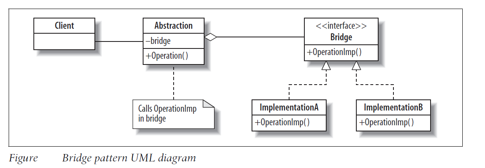

# Bridge Pattern

## Мотивация

 * Служи за за комуникация между различни интерфейси. Заменя експоненциално нарастващото наследяване с композиция. 
 * Създаването на различните компоненти на даден клас се осъществява чрез обекти, представители на интерфейс. Това позволява на всеки клас, наследяващ базовия интерфейс да реши коя конкретна имплементация на другия интерфейс да ползва.
 

## Цел

 * Минимализиране на създадените класове и вдигане на абстракцията.

## Приложение

* Пример:
 
	Нека имаме фабрика за създаване на книги. Всяка една книга може да се печата, написана от ляво на дясно за нормални хора(ние), от дясно на ляво за араби и от горе на долу за извънземни. Бихме могли да създадем три различни класа книги, които да знаят как се печатат и когато искаме да имплементираме нова логика да добавяме още класове. Дотук добре, но ако искаме да правим същото и за списание и друг вид хартиени носители, класовете ни стават прекалено много. Затова решението е да елиминираме наследяването като го заменим с интерфейс който се подава като параметър на всеки един хартиен носител. Тогава клиентът ще решава по какъв точно начин иска да принтира книгите и прочие като добавянето на нови класове и в двата интерфейса няма да зависят един от друг нито да увеличат класовете експоненциално.
	
    
## Известни употреби
* създаване на контроли

## Имплментация 

```c#
using System;
using System.Collections.Generic;
 
namespace DoFactory.GangOfFour.Bridge.RealWorld
{
  /// <summary>
  /// MainApp startup class for Real-World 
  /// Bridge Design Pattern.
  /// </summary>
  class MainApp
  {
    /// <summary>
    /// Entry point into console application.
    /// </summary>
    static void Main()
    {
      // Create RefinedAbstraction
      Customers customers = new Customers("Chicago");
 
      // Set ConcreteImplementor
      customers.Data = new CustomersData();
 
      // Exercise the bridge
      customers.Show();
      customers.Next();
      customers.Show();
      customers.Next();
      customers.Show();
      customers.Add("Henry Velasquez");
 
      customers.ShowAll();
 
      // Wait for user
      Console.ReadKey();
    }
  }
 
  /// <summary>
  /// The 'Abstraction' class
  /// </summary>
  class CustomersBase
  {
    private DataObject _dataObject;
    protected string group;
 
    public CustomersBase(string group)
    {
      this.group = group;
    }
 
    // Property
    public DataObject Data
    {
      set { _dataObject = value; }
      get { return _dataObject; }
    }
 
    public virtual void Next()
    {
      _dataObject.NextRecord();
    }
 
    public virtual void Prior()
    {
      _dataObject.PriorRecord();
    }
 
    public virtual void Add(string customer)
    {
      _dataObject.AddRecord(customer);
    }
 
    public virtual void Delete(string customer)
    {
      _dataObject.DeleteRecord(customer);
    }
 
    public virtual void Show()
    {
      _dataObject.ShowRecord();
    }
 
    public virtual void ShowAll()
    {
      Console.WriteLine("Customer Group: " + group);
      _dataObject.ShowAllRecords();
    }
  }
 
  /// <summary>
  /// The 'RefinedAbstraction' class
  /// </summary>
  class Customers : CustomersBase
  {
    // Constructor
    public Customers(string group)
      : base(group)
    {
    }
 
    public override void ShowAll()
    {
      // Add separator lines
      Console.WriteLine();
      Console.WriteLine("------------------------");
      base.ShowAll();
      Console.WriteLine("------------------------");
    }
  }
 
  /// <summary>
  /// The 'Implementor' abstract class
  /// </summary>
  abstract class DataObject
  {
    public abstract void NextRecord();
    public abstract void PriorRecord();
    public abstract void AddRecord(string name);
    public abstract void DeleteRecord(string name);
    public abstract void ShowRecord();
    public abstract void ShowAllRecords();
  }
 
  /// <summary>
  /// The 'ConcreteImplementor' class
  /// </summary>
  class CustomersData : DataObject
  {
    private List<string> _customers = new List<string>();
    private int _current = 0;
 
    public CustomersData()
    {
      // Loaded from a database 
      _customers.Add("Jim Jones");
      _customers.Add("Samual Jackson");
      _customers.Add("Allen Good");
      _customers.Add("Ann Stills");
      _customers.Add("Lisa Giolani");
    }
 
    public override void NextRecord()
    {
      if (_current <= _customers.Count - 1)
      {
        _current++;
      }
    }
 
    public override void PriorRecord()
    {
      if (_current > 0)
      {
        _current--;
      }
    }
 
    public override void AddRecord(string customer)
    {
      _customers.Add(customer);
    }
 
    public override void DeleteRecord(string customer)
    {
      _customers.Remove(customer);
    }
 
    public override void ShowRecord()
    {
      Console.WriteLine(_customers[_current]);
    }
 
    public override void ShowAllRecords()
    {
      foreach (string customer in _customers)
      {
        Console.WriteLine(" " + customer);
      }
    }
  }
}
 
  ```

## Последствия
* Лесно добаване на нови функционалности и по-висока абстракция

## Сродни модели
* Decorator Pattern

## Проблеми
* По-сложен код. При прости и ясни йерархии от класове без перспектива за развитие би могло да бъде overkill.

## UML  диаграма


